# The-Shaurya-Fitness
Project-portfolio-5

[Live Site](https://the-shaurya-fitness-509fd3f24de8.herokuapp.com/)

## Table of Contents
- [The Shaurya Fitness](#the-shaurya-fitness)
  - [Table of Contents](#table-of-contents)
- [Introduction](#introduction)
- [UX](#ux)
  - [Strategy](#strategy)
  - [Marketing Strategy](#marketing-strategy)
  - [Scope](#scope)
  - [Structure](#structure)
  - [Skeleton](#skeleton)
  - [Surface](#surface)
- [Agile](#agile)
  - [Epics](#epics)
  - [Sprints](#sprints)
- [Features](#features)
  - [Header](#header)
  - [Footer](#footer)
  - [Homepage](#homepage)
  - [Producers](#producers)
  - [Products / Store](#products--store)
  - [Product Details](#product-details)
  - [Bag / Cart](#bag--cart)
  - [Checkout](#checkout)
  - [Order Confirmation / history](#order-confirmation--history)
  - [User Profiles](#user-profiles)
  - [Product Management](#product-management)
  - [Error Pages](#error-pages)
- [Marketing Strategy Implementation](#marketing-strategy-implementation)
  - [Branding](#branding)
  - [SEO](#seo)
  - [Keywords](#keywords)
  - [Newsletter](#newsletter)
  - [Social media](#social-media)
- [Testing](#testing)
- [Technologies used](#technologies-used)
  - [Languages](#languages)
  - [Libraries / Frameworks](#libraries--frameworks)
- [Running Locally](#running-locally)
  - [Prerequisites](#prerequisites)
  - [Installation](#installation)
- [Deployment](#deployment)
  - [Prerequisites](#prerequisites-1)
  - [Deployment to Heroku](#deployment-to-heroku)
- [Future Development](#future-development)
- [Credits](#credits)
  - [Media](#media)
  - [Code](#code)
- [Acknowledgements](#acknowledgements)

# Introduction

Welcome to my ecommerce website "The Shaurya Fitnness' - an online store for Workout clothing and accessories exclusively for women!! It is a B2C e-commerce website for the final project of the Code Institute diploma in Software Development.

The site provides role based permissions for users to interact with a central dataset. It includes user authentication, email validation and full CRUD functionality for approved users for Products.

The payment system uses Stripe. Please note that this website is for educational purposes only and the payment gateway is not set up to accept real payments. Do not enter any personal credit/debit card details when using the site.

When testing the site, please use the following from Stripe's testing documentation:

- a Stripe test card number, such as 4242 4242 4242 4242.
- a future expiry date, such as 04/26.
- any three-digit CVC.

# UX

## Strategy

### The Problem
While researching for activewear market, I found out the increased demand of athleisure brands among women who want to look stylish and feel comfortable at the same time. At the same time fast fashion is a real problem in today's world, due to social media influencer trends, remote working and relaxed dress codes, increased awareness of wellness and fitness culture has heightened the demand.

### The Solution
Lets put the focus on designing an ecommerce website for activewear exclusively for women, which encompasses the use of recycled materials, hence reducing the carbon footprint and encouraging slow fashion with stylish workout wear that does not compromise on the performance, but adds on to the increasing deamnds of athleisure clothing.

### Target audience
Women who are passionate about their physical fitness and love to add style too in their workout wear wardrobe.

*Go back to the [top](#table-of-contents)*

---

## Marketing Strategy
The main goal of the company is to increase sales to add on to the increasing demands of fitness among women and encourage slow fashion at the same time. To increase sales, we need to raise awareness of the brand and allow the products to be available to a much larger number of people. This is where the website comes in.

Having a strong brand and a solid, trustworthy and easy to use website creates a good foundation for the company to build its online presence, massively increasing its reach in comparison to a handful of shop fronts across the country.

With the website as an asset and a newsletter email list as a starting point, we can then share the brand on social media or online advertising, continue to evolve the SEO, and build out additional features (such as a blog, educational resources and charity campaigns) to help increase traffic to the site. We could run social media competitions and email campaigns.

*Go back to the [top](#table-of-contents)*

----

## Scope

### User Expectations
1. As a user I expect the app to be responsive.
2. As a user I expect the app to be accessible.
3. As a user I expect my data to be secure.

### User Stories
4. As a user, I want to see an interesting homepage, So that I can learn about the store and the type of products it sells.
5. As a user, I want to subscribe to a newsletter, So that I can receive updates about the store.
6. As a user, I want to register my profile, So that I can save my personal information for future shopping.
7. As a user, I want to view the list of products available, So that I can see what the store has to offer.
8. As a user, I want to filter the products, So that I can narrow down my search.
9. As a user, I want to search for specific products, So that I can avoid clicking through pages.
10. As a user, I want to add products to my bag, So that I can save what I might purchase later.
11. As a user, I want to remove products from my bag, So that I can edit the order before checking out.
12. As a user, I want to edit the quantities of items in my bag, So that I can edit the order before checking out.
13. As a user, I want to go through a checkout process, So that I can review my bag and add my details to complete my purchase.
14. As a user, I want to provide card details, So that I can pay for the products in my cart.
15. As a user, I want to have my payment processed, So that I can complete my order.
16. As a user that's logged in, I want my details to be autofilled at checkout, So that I can make purchase quicker and easier.
17. As a user, I want to see feedback on my actions, So that I can get confirmation of the actions I've taken.

### User (Owner) Stories
18. As a superuser, I want to add products to the store, So that I can offer products to seel and add new products in the future.
19. As a superuser, I want to update products, So that I can keep them up to date.
20. As a superuser, I want to delete products, So that users won't buy unavailable products.

All the user stories were further divided into milestones divided across § 3 sprints based on priority with must-haves, should-haves and could haves that are seen on GitHub Issues section.

#### SPRINT 1
---

1. BASE SETUP (Milestone 1)
- Initial Setup
- Create Base.html
- Create Nav-bar
- Create Footer

2. AUTHENTICATION (Milestone 2)
- AllAuth Authentication
- Style AllAuth pages.

3. ABOUT Ss(Milestone 3)
-S Create Homepage.

#### SPRINT 2
---

4. NEWSLETTER (Milestone 4)
- Create a newsletter model adde to the footer.

5. CONTACT FORM (Milestone 5)
- Create a contact form

6. FAQ (Milestone 6)
- Create a FAQ page.

7. CLOTHING (Milestone 7)
- Create a clothing link for all fitness wear collection.
-  Add items to my bag
- Edit quantity of items in my bag.

8. ACCESSORIES (Milestone 8):
- Create a accessories link for all the accessories collection.
- Add items to my bag
- Edit quantity of items in my bag.

9. SORTING AND SEARCHING (Milestone 9)
- Sorting and searching the products.
- Filtering the products according to price and category.

10. SHOPPING BAG (milestone 10)
- Add sizes to clothing and accessories products.
- Remove and update products from the bag.

11. REGISTRATION AND USER ACCOUNT (Milestone 11)
-  Every user has a personalised profile to view orders and order history.

12. ADMIN AND STORE MANAGEMENT (Milestone 12)
- As a store owner, able to add, update and delete products from the store.

13. PURCHASING AND CHECKOUT (Milestone 13)
- As a user be able to add, remove, update, products in bag, go through a checkout, enter card details to make a payment, and complete my order after successful order placement.

14. DEPLOYMENT (Milestone 14)
- Setup White noise for static files.
- Deploy to Heroku.

#### SPRINT 3
---
15. STAND ALONE PAGES (Milestone 15)

- Create 400, 403, 404 and 500 error pages.

16. DOCUMENTATION (Milestone 16)
- Create FB page for the website
- SEO Implementation
- Write Readme and Testing.md

**DATABASE MODELS**

Thanks to DBeaver that helped me create the diagram of models.

*Go back to the [top](#table-of-contents)*

---

## Skeleton

The website uses a well-known and well-experienced web design pattern, to provide a comforting and predictable experience to users. With the logo in the top left, navigation in the middle and important links in the top right. Each page has a large title, except for the product detail page. The header and footer on each of the longer pages matches, allowing users to quickly find their way around. The main page wireframes, with help from Balsamiq, are shown below.

Home

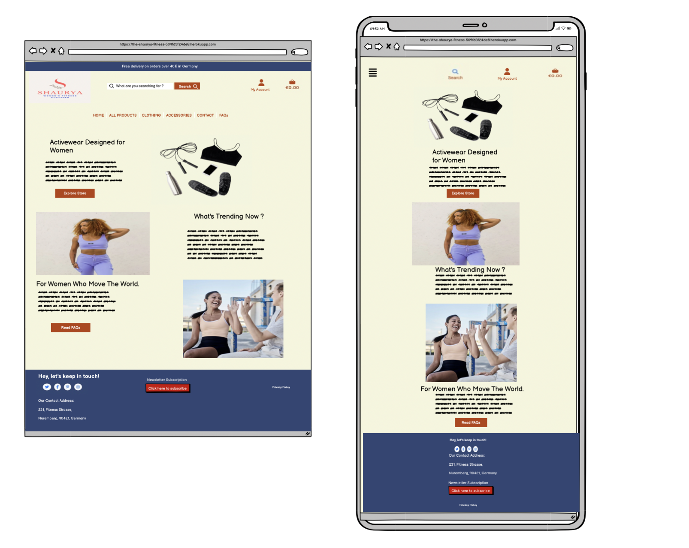

Bag

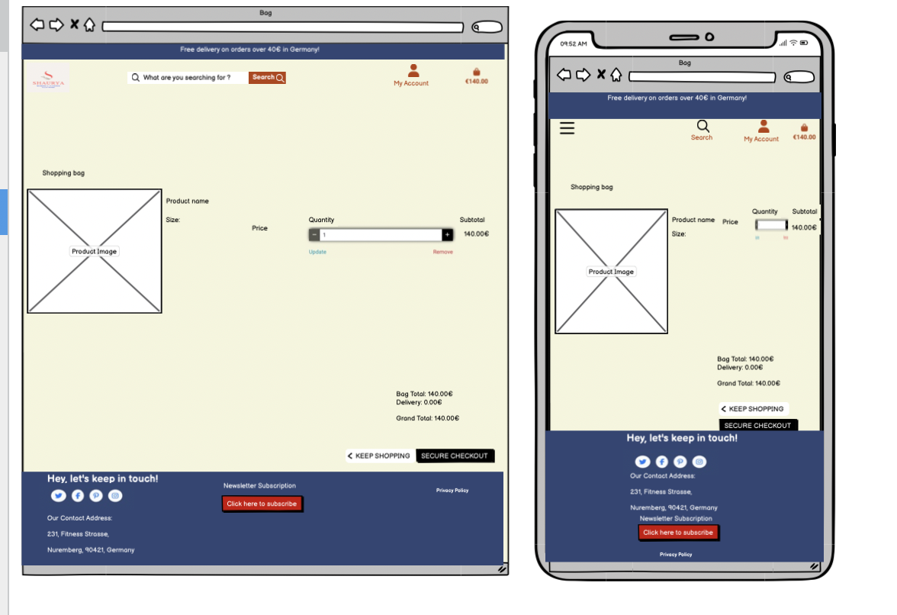

All Products

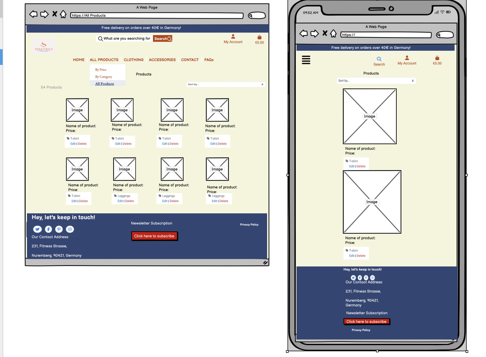

Product Details

Checkout

Contact

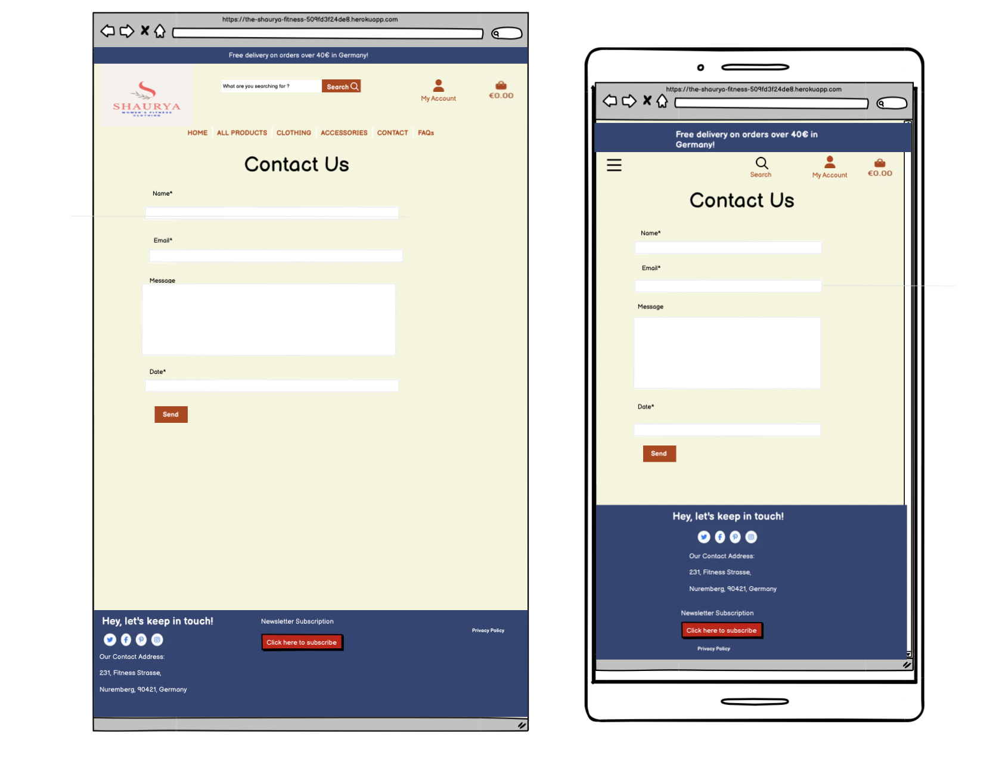

FAQ

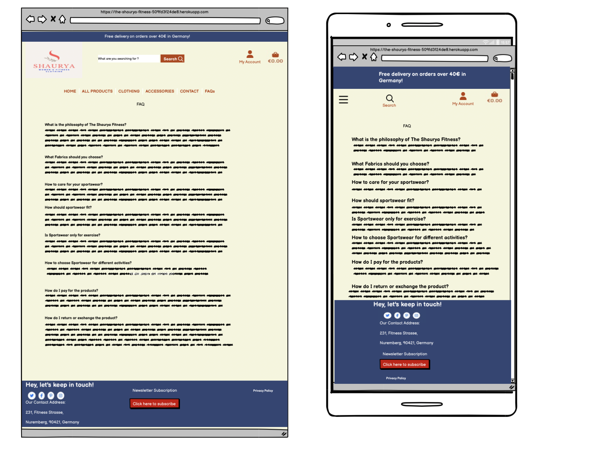

*Go back to the [top](#table-of-contents)*

----
## Surface
I wanted to create a modern yet a website with neutral organic tones of color, unlike usual clothing websites that have a black and white layout. Hence chose colorsl ike like beige and rust red with a pop of light navy blue to be added on the banner and footer.
These are the keywords to lead the brand design:

- Earthy
- Modern
- Friendly

### Colours

Inspired by earthy and organic tones of color, I settled on the following colour palette.

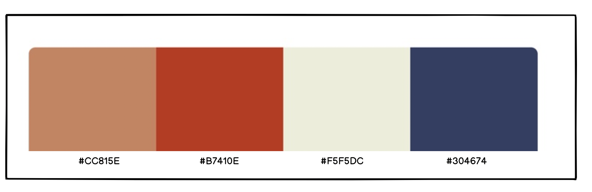

### Font

[Roboto](https://fonts.google.com/specimen/Roboto?query=roboto) is the font used throughout the site and the title uses [EB Garamond](https://fonts.google.com/specimen/EB+Garamond). Both are easy to read fonts, with just enough character to make it modern different and unique.

### Images

The photographs used in throughout the app are all wonderful photographs from Unsplash.

### Bootstrap

I opted for Bootstrap 4 as I followed the Boutique_Ado walkthrough project and it helped me install django countries, django version 5.2.7, django all auth and django crispy forms eith compatible versions for the project.

*Go back to the [top](#table-of-contents)*

# Agile

I used Agile development methodologies, and the project was broken up into Epics. These Epics roughly translate to apps within the Django project. Each User Story was added to it's relevant Epic, and each User Story was further broken down into smaller tasks.

## Epics

- Products
- Profiles
- Cart / bag
- Homepage
- Checkout
- Newsletter
- Contact
- FAQ

----

# Features

Everything that was scheduled to be added to the app has been implemented.

## Header

On opening the site, users will be welcomed by a muted beige colored page with pops of color added by rust red icons and Nav-Bar links and buttons.

- The header has a free delivery threshold banner in a pop of blue color, to let users know that they can get free shipping if they place an order over €40.
- On larger screens, the logo sits in the top left. This is moved to an offcanvas (slide in) menu on smaller screens to reduce the header size.
- On larger screens, there is a search form in the centre. This is also moved to the offcanvas (slide in) menu on smaller screens.
- The "Account" button displays a dropdown menu that provides links for "Register" and "Login", allowing users to either register for a new account, or login with an existing one. Once logged in, the links update to "My Profile" and "Logout". If logged in as a superuser, there is also a "Product Management" link available here.
- The bag button opens up a mini version of the bag page. If there are no items in the bag, it will show a button to "Continue shopping". If there are items, it will display a summary of these, along with a subtotal, delivery charge and grand total.
- The main navigation contains the "Home", "All Products", "Clothing", "Accessories", "Contact" and "FAQ" links, helping users to easily navigate to the main parts of the site.
- On smaller screens, the main navigation is replaced with a "hamburger" icon on the left side. Clicking on the hamburger button reveals the offcanvas menu with main navigation and its dropdown links, leaving just the search, "Account" and bag buttons visible for easy access.

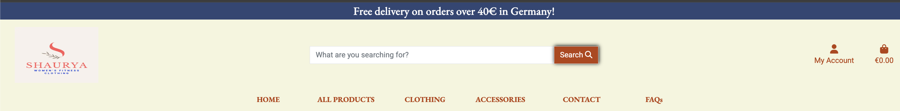
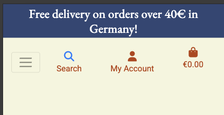

## Footer

The footer compliments the primary beige colour of the site by using a dark blue.

- The "keep in touch" section provides social media icons that (would) connect to the company's various social media accounts. These are external links and open in a separate tab for convenience, and to allow the user to return to the site easily.
- There's a button to subscribe to the newsletter. This opens in a new window so the user can enter their email address.  If the user has not already subsribed, they will see a success message. If they have already subscribed, they will see a message stating this.
- There is Link to the "Privacy Policy". These three pages help SEO by allowing spiderbots to crawl the site easily, and providing more trust, for both users and search engines.
- At the very bottom is the copyright, along with a disclaimer that this is an educational site only.

¡[Footer](docs/features/Footer.png)

## Homepage

The homepage is a celebration of the company, giving users a warm welcome to the site.

- The starting image is of various accessories and a pragraph about what the website offers, that is, Actiwear for Women". It also has an 'Explore Store' button to redirect users to the Products page.

- It also talk about 'what the new trends are'?
- And lastly the image displays on how women can get answers about various fitnessa nad website related questions answered by following the FAQ page. The 'FAQ' button redirects the users to FAQ page.

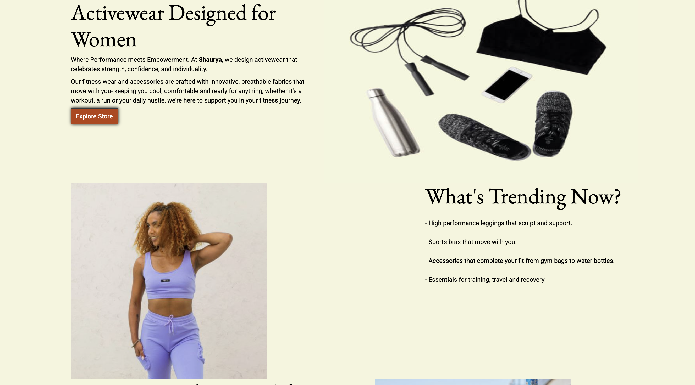

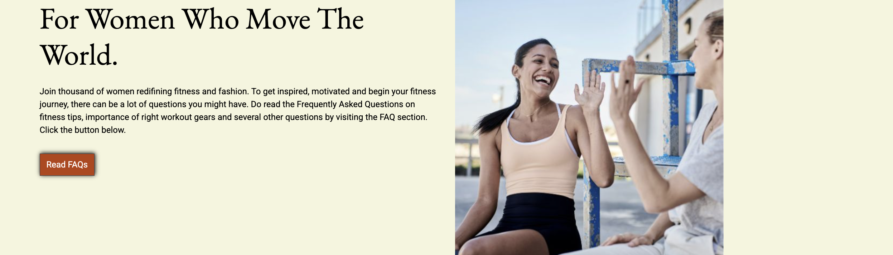

## All Products
- It has two filter dropdowns to search for products 'By Price' and 'By category'.
- It also has a link to All Products to guide users to all products page.
- If a user were to use the search form in the header, they would be brought to this same page, but with their search results visibile instead of the full list of products.

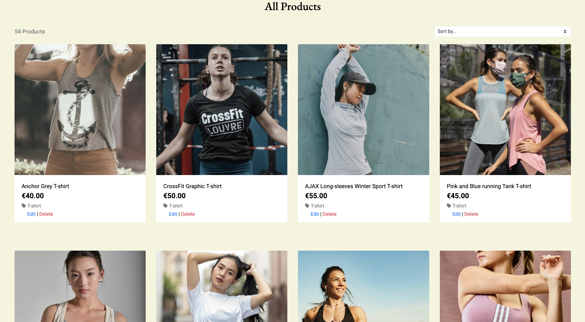

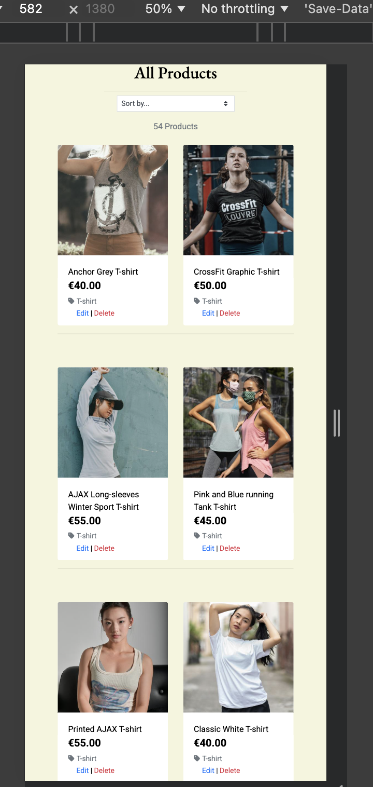

## Clothing
- This link displays only Clothing dropdown list such as T-shirts, Leggings, Shorts, All Clothong and All Products links.
- This has been created to make the search category easy instead of browsing through the entire Products search. User can choose the category of item they want to purchase and they will be guided only to those products.
- A sort category is vailable on all pages of products to sort items in alphabetical order, by price(low-high) or (high to low).

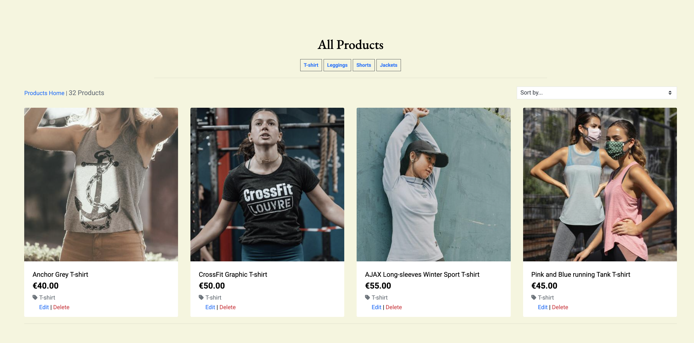

## Accessories
- This link displays only Accessories dropdown list such as Socks, Sunglasses, Backpack, Shoes, All Accessories and All Products links.
- This has been created to make the search category easy instead of browsing through the entire Products search. User can choose the category of item they want to purchase and they will be guided only to those products.
- A sort category is vailable on all pages of products to sort items in alphabetical order, by price(low-high) or (high to low).

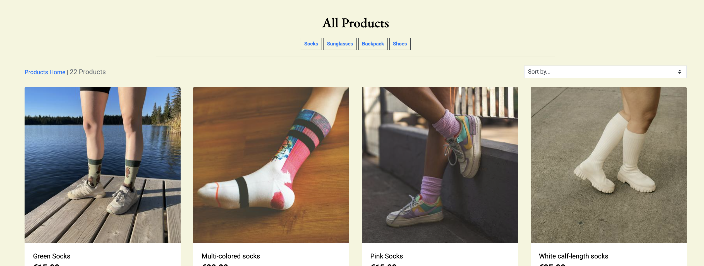

## Product Details

The Product Details page provides further information about the selected product.

- There is a large image of the product on the left side.
- The price, size and description are shown on the right side.
- The user has the option to choose a quantity and add the item to the bag. The quantity form has a minimum of 1 and a maximum of 99.
- When logged in as a superuser, extra buttons appear on the product images: "Update product" and "Delete product". These give the superuser quick access. The update button opens up the Product Management page for that particular product. The delete button directly deletes the product, so any product must be deleted with caution.

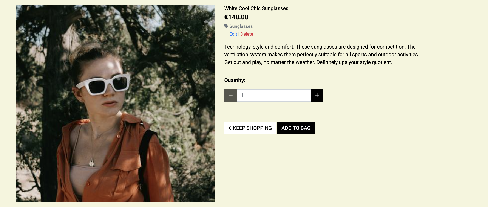

## Checkout

The checkout page displays a bag summary on the right side, followed by the same subtotal, delivery cost and grand total that we've seen in the bag already.

- The left side shows a tidy form to collecting the user's contact and shipping information.
- Below this is an option to register an account or login to save the details to their profile.
- Once logged in, this paragraph changes to a checkbox "Save to profile". If checked, the user's contact and shipping information will be saved to the user's profile to be autofilled should they place another order.
- At the bottom of the form is the Stripe field for the user's payment information.
- Lastly, there is a button to "Return to Bag", should the user not be ready to checkout just yet. And a button for "Secure Checkout", with the payment amount underneath. Clicking on this will process the payment.
- The form uses Django's form validation and cross site request forgery protection.

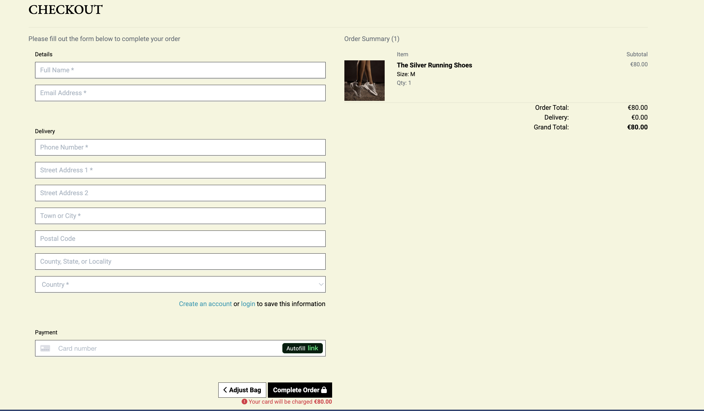

## Order Confirmation / history

Once a user has checked out, they'll see an order confirmation page.

- The page thanks the user for placing their order, and let's them know that they will receive a confirmation via email as well. The email that's sent to the user is sent via Gmail SMTP and contains a summary of the order, along with a confirmation of the address that it will be shipped to.
- The confirmation page displays all of the order details in a tidy layout, clearly showing the information provided by the user (minus the payment details) and a summary of the order.
- It also displays the date and time of the order, and a truncated order number. The order number is very long and is included in the order confirmation email and the URL, so not required to be shown in full here.
- This same page can be visited via the Profile page too, to display historical orders.

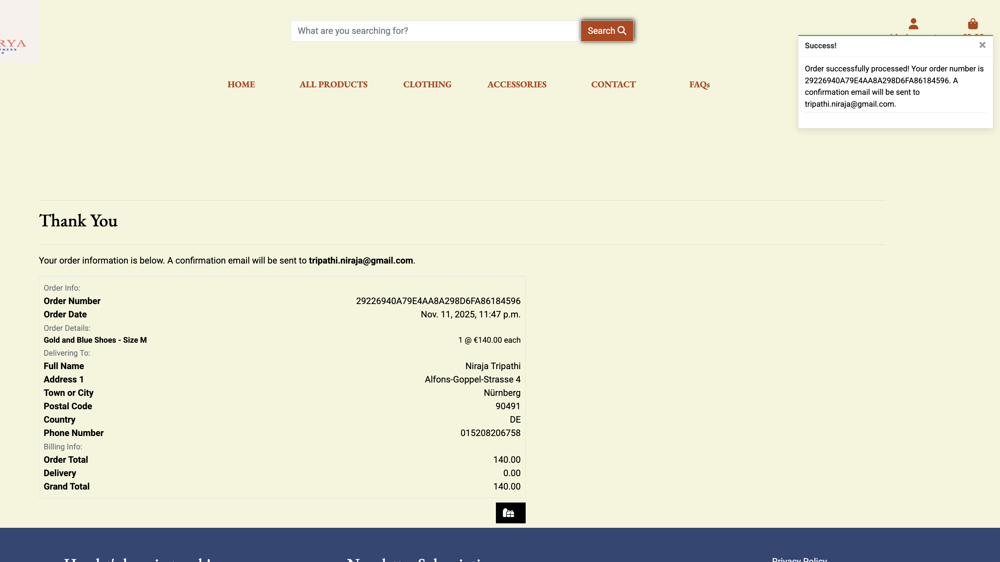

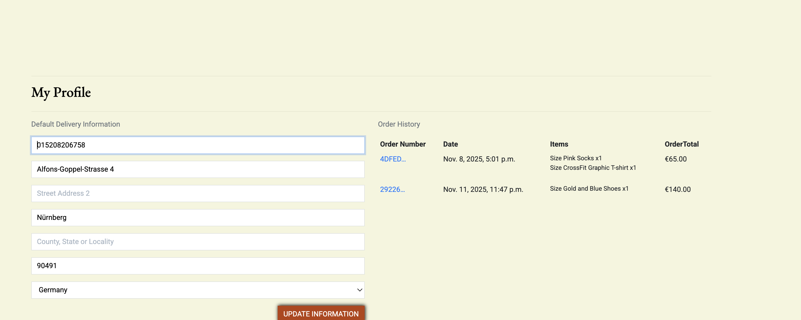

## User Profiles

When a user is logged in, they'll have access to the "My Profile" link from the "Account" button's dropdown menu.

- The left side of the page shows the saved information for that user. It's in the format of a form, so the user can make changes and update their profile using the "Update profile" button at the bottom.
- The user will receive a message when the profile is updated successfully.
- The default delivery details are used to autofill the checkout form.
- The right side of the profile view displays any historical orders. Clicking on the order number of these will show the full order details, as mentioned above.

¡[Profile](docs/features/Profile_Order.png)

## Product Management

The product management page is available to superusers only.

- When logged in as a superuser, the "Product Management" link becomes available in the "Account" button's dropdown menu.
- The Product Management page offers a form for the superuser to add products to the store.
- This same form is used if a superuser chooses to edit a product, either from the Products page or the Product Detail pages. Except the fields will be pre-filled with the information for the product that was selected to be updated.
- For updating, the header changes slightly to say "Update a product" instead of "Add a product". And there is a note in read stating which product the superuser is making changes to.

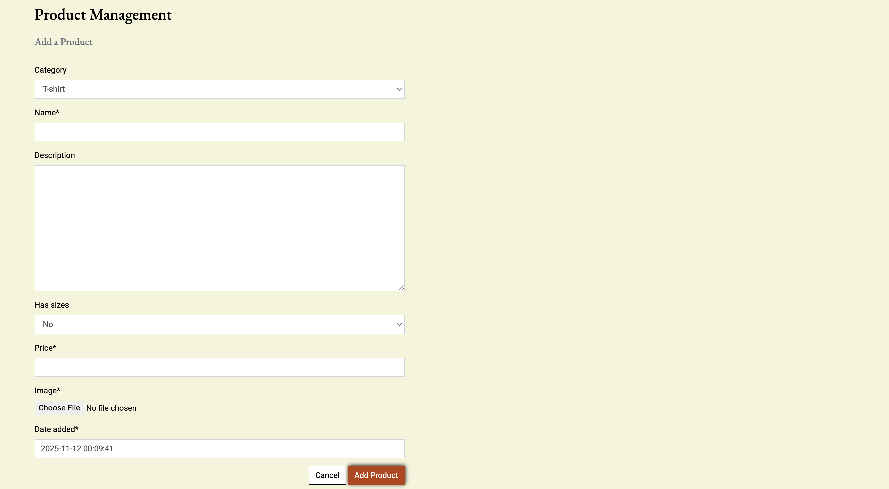

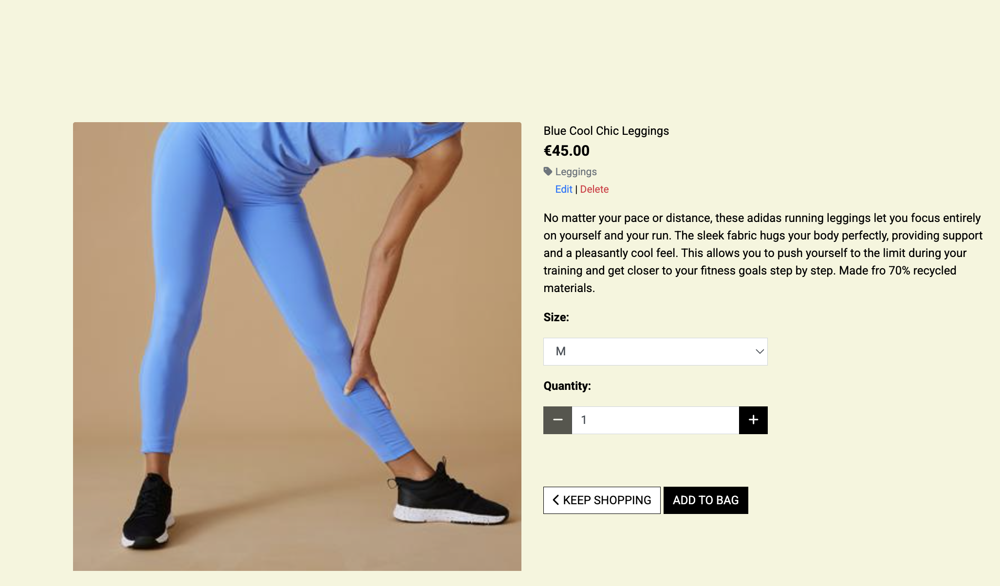

