# The shaurya Fitness Testing
[Return to the README](README.md)

## Table of Contents

- [The Shaurya Fitness Testing](#the-shaurya-fitness-testing)
  - [Table of Contents](#table-of-contents)
- [Performance](#performance)
  - [Google's Lighthouse Performance](#googles-lighthouse-performance)
- [Accessibility](#accessibility)
  - [Accessibility Validation](#accessibility-validation)
- [Code Validation](#code-validation)
  - [HTML Validation](#html-validation)
  - [CSS Validation](#css-validation)
  - [JS Validation](#js-validation)
  - [PEP8 Validation](#pep8-validation)
- [Testing](#testing)
  - [Manual Testing (BDD)](#manual-testing-bdd)
  - [Automated Testing (TDD)](#automated-testing-tdd)
- [Bugs](#bugs)

# Performance

## Google's Lighthouse Performance

[Google Lighthouse](https://developers.google.com/web/tools/lighthouse) was used to test the performance of the website. There are a couple of issues due to Bootstrap, Stripe and general Heroku slowness.

Home

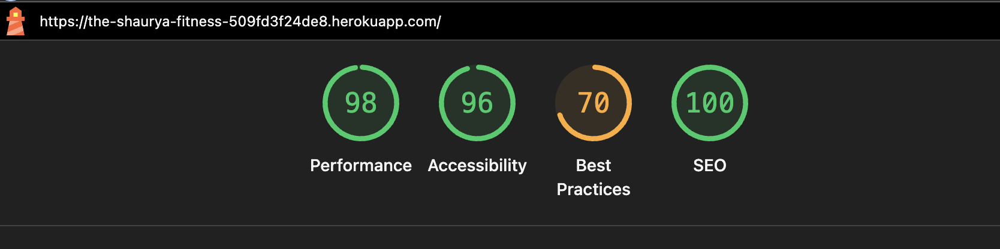

Register

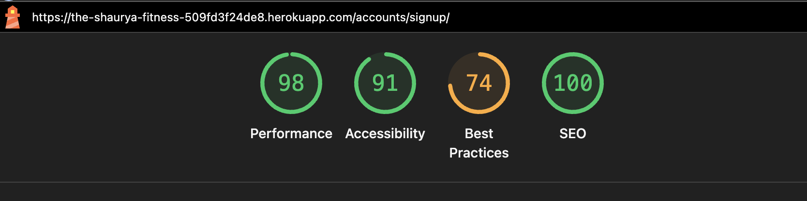

Products

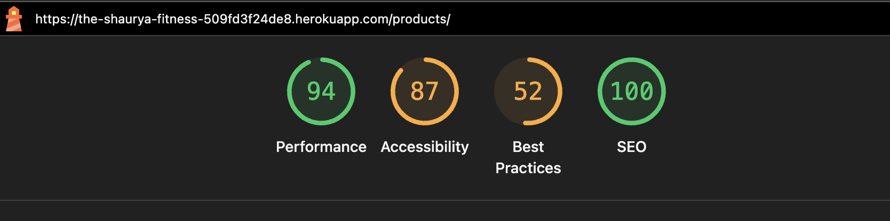

Product-Detail

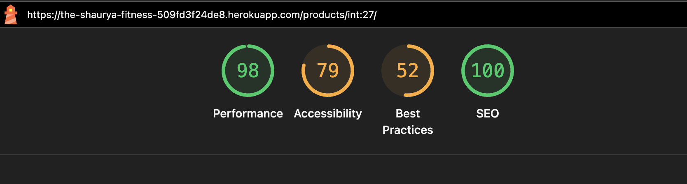

FAQ

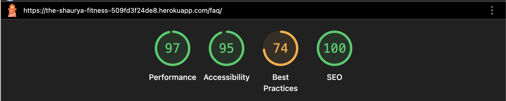

Contact

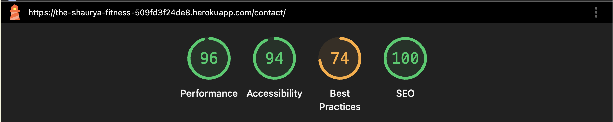

Profile

Checkout

Order Confirmation

Privacy Policy

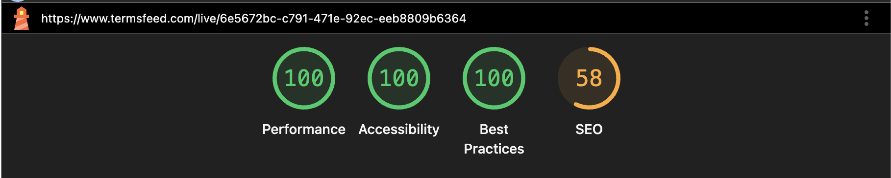

*Go back to the [top](#table-of-contents)*

---

# Accessibility

## Accessibility Validation

The [WAVE WebAIM web accessibility evaluation tool](https://wave.webaim.org/) was used to ensure the website met high accessibility standards. The 2 errors seen are beacuse of not using labels for form-control which is for all pages and a contrast error for signin on register page which is a default in allauth account.

Home-Wave

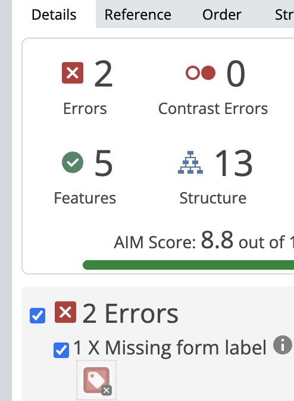

Register

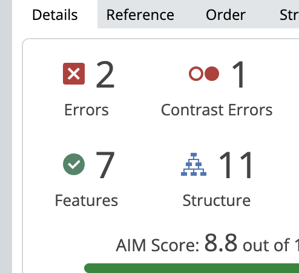

Products

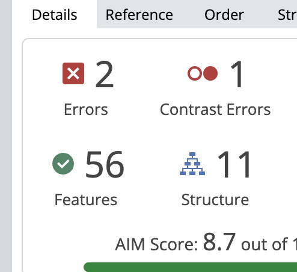

Product Details

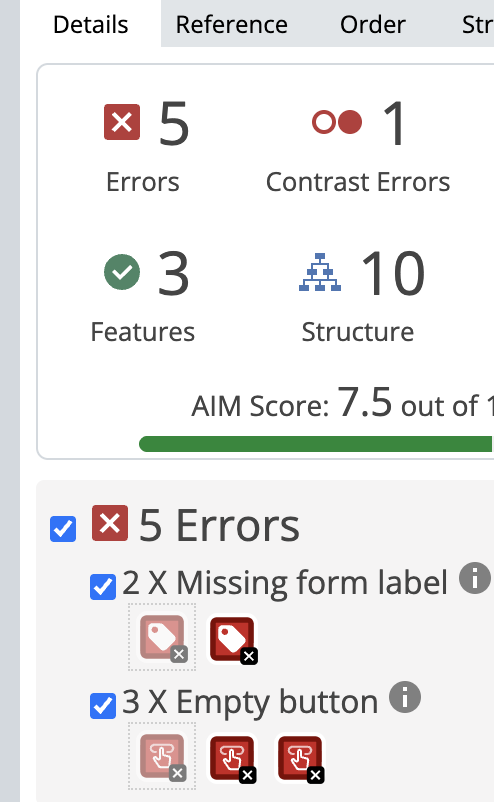

Faq

Contact

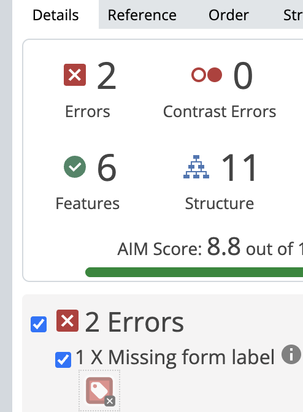

Profile

Checkout

Order Confirmation

Privacy policy

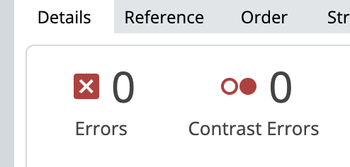

*Go back to the [top](#table-of-contents)*

## HTML Validation

The [W3C Markup Validation Service](https://validator.w3.org/) was used to validate the HTML of the website.

Home

Products

Product-details

Register

Profiles

Faq

Contact

Order Confirmation

Privacy Policy

*Go back to the [top](#table-of-contents)*

## CSS Validation

The [W3C Jigsaw CSS Validation Service](https://jigsaw.w3.org/css-validator/) was used to validate the CSS of the website. The CSS passes with 0 errors.

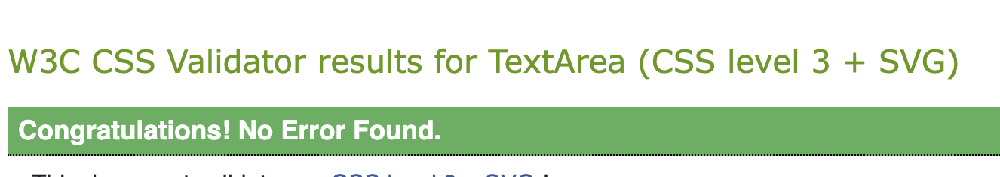

*Go back to the [top](#table-of-contents)*

## JS Validation

[JSHint](https://jshint.com/) was used to validate the JavaScript/Jquery of the website. No issues were found.

Base JS

Country field handler

Sort selector

Stripe handler

*Go back to the [top](#table-of-contents)*

## PEP8 Validation

All pages were run through the official [Pep8ci](https://pep8ci.herokuapp.com/) validator to ensure all code was pep8 compliant.

*Go back to the [top](#table-of-contents)*

# Testing

## Manual Testing (BDD)

BDD, or Behaviour Driven Development, is the process used to test user stories in a non-technical way, allowing anyone to test the features of an app.

User Story | BDD Test | Pass
--- | --- | :---:
As a user I want to see an interesting homepage So that I can learn about the store and the type of products it sells | Given that I'm a new visitor to the website When I view/scroll down the homepage Then I should see what they sell and what they care about | pass
As a user I want to subscribe to a newsletter So that I can receive updates about the store | Given that I am not already subscribed When I click the "Subscribe" button in the footer and enter my email address Then I should see confirmation that I have subscribed to the newsletter | pass
As a user I want to register my profile So that I can save my personal information for future shopping | Given that I'm not already registered When I click on "Account" -> "Register" and submit my information Then I should see confirmation that my profile has been created and I should be able to login |
As a user I want to view the list of products available So that I can see what the store has to offer | Given that I'm on the homepage When I click on the "Explore Store" button or "Full Range" -> "All Products" Then I should be taken to the Products page where I can see all of the products available | Pass
As a user I want to see the products filtered by category So that I can narrow down the products and find what I need easier | Given that I'm on the homepage When I click on "Full Range" and a category Then I should only see that particular category's products | Pass
As a user I want to filter the products So that I can narrow down my search | Given that I'm on the Products page When I click on "Sort By" and choose an option Then I expect to only see the products related to that specific filter | Pass
As a user I want to search for specific products So that I can avoid clicking through pages | Given that I want to search for "white chocolate" When I type this into the search form and click search Then I should only see products that mention "Leggings" in their title or description | Pass
As a user I want to add products to my bag So that I can save what I might purchase | Given that I'm on a Product Detail page When I click on "Add to bag" Then I should see confirmation that my item has been added to the bag and be able to see it in the mini-bag/Bag | Pass
As a user I want to remove products from my bag So that I can edit the order before checking out | Given that my bag is not empty and I'm on the Bag page When I click on the remove link Then I expect the item to be removed from the bag and to see confirmation of this | Pass
As a user I want to edit the quantities of items in my bag So that I can edit the order before checking out | Given that my bag is not empty and I'm on the Bag page When I click on the plus or minus buttons, followed by "Update" Then I should see the quantity and order totals update | Pass
As a user I want to go through a checkout process So that I can review my bag and add my details to complete my purchase | Given that I'm on the mini-bag/Bag page When I click on "Secure Checkout" Then I should see a form where I can enter my details to start the checkout process |
As a user I want to provide card details So that I can pay for the products in my cart | Given that I'm on the Secure Checkout page When I've filled in my details and scrolled down Then I should see a section where I can enter my payment details |
As a user I want to have my payment processed So that I can complete my order | Given that I've entered my personal details and card details on the Secure Checkout page When I click the "Pay Now" button Then I should see confirmation that all is well and my order has been received |
As a user that's logged in I want my details to be autofilled at checkout So that I can make purchase quicker and easier | Given that I've already filled in my profile information When I next go to checkout Then I should see my details already populated in the checkout form | Pass
As a superuser I want to add products to the store So that I can offer products to seel and add new products in the future | Given that I'm a logged in superuser When I click on "Account" -> "Product Management" Then I should be able to complete the form and submit for new products to be added to the store | Pass
As a superuser I want to delete products So that users won't buy unavailable products | Given that I'm a logged in superuser and on the Products or Product Detail page When I click on the "Delete" button  then the product is deleted | Pass
As a user I want to view the FAQ page  so that I can get answers to basic questiosns about the website | Anyone can click on the FAQ page from Nav-heading and read about the frequently asked questions about clothing, shipping, costs etc | Pass
As a user I want to contact the website and drop any message or query so that I can get answers to my questions not listed in FAQ | Anyone can access the contact form and get a confirmation message that the form has been received | Pass

*Go back to the [top](#table-of-contents)*

---

# Bugs

Below is a list of everything stumbled upon during development.

Resolved | Bug | Fix
:---: | --- | ---
Yes | Product Images not loading on Heroku  | Change Image field to 'CloudinaryField' in Products Model |
No | New profile not being created on Heroku.Shows 404 error |
No | Checkout page showing 404 error on Heroku |
No | Order history not seen on Heroku |

